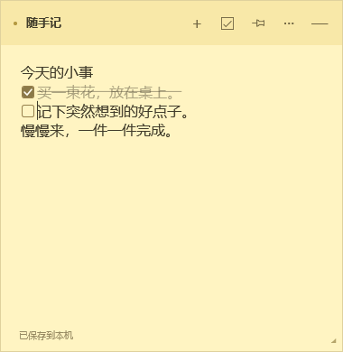

# 桌面便签 · 随手记

一个 Windows 原生文字便签，使用 C#、WPF 和 .NET 8。不需要账号，内容保存在本机。



## 功能

- 多张便签、自动保存、位置与大小记忆。
- 可选的逐行勾选框，完成后文字变浅并显示删除线。
- 三种浅色背景、独立置顶、任务栏与托盘图标。
- 支持中文输入、撤销重做和快捷键；数据不上传到服务器。

## 打开

系统要求：Windows 10 / 11，以及 [.NET 8 Desktop Runtime](https://dotnet.microsoft.com/download/dotnet/8.0)（Windows x64 桌面运行时）。

在仓库的 [Releases 页面](https://github.com/JarrettKang/desktop-notes/releases/latest)下载 `DesktopNotes-v0.1.1-win-x64.zip`，解压整个文件夹后双击 `DesktopNotes.exe`。请保留同目录的 DLL 和配置文件。

从源码使用时，先按下方说明构建，再双击项目根目录的 `启动便签.cmd`，或打开 `artifacts/app/DesktopNotes.exe`。

## 使用

- 点击正文输入，停顿约半秒后自动保存。左下角显示保存状态。
- 拖动顶栏移动；拖动边框或右下角改变大小。
- 点击 `+` 或按 `Ctrl+N` 新建便签。
- 把光标放到某一行，点击顶栏勾选框按钮或按 `Ctrl+Shift+C`，即可添加 / 移除该行的勾选框。选中多行可批量操作；混合选中普通行和待办行时会补齐勾选框，全部已有勾选框时会移除。
- 点击行首方框勾选 / 取消勾选，也可以在该行按 `Ctrl+Enter`。状态自动保存，支持撤销和重做。右键正文也能找到这些操作。
- 勾选后，该项文字会变浅并显示删除线；取消勾选恢复原样。长行自动折行后的全部内容也会显示完成样式，仍可直接编辑。
- 长行自动折行仍算同一条；按回车新建的行默认是普通文字，可按需添加勾选框。
- 点击图钉开关置顶。
- 点击 `···` 换颜色或删除便签。删除前会确认。
- 底部任务栏与右下角托盘都使用黄色便签图标。多张便签由 Windows 按应用分组，可从任务栏预览选择。
- 点击右上角 `—` 或按 `Alt+F4` 保存并最小化当前便签到任务栏，点击对应的任务栏图标或预览即可恢复。完全退出请使用托盘右键菜单的“退出”。
- 在任务栏右下角找到黄色便签托盘图标（可能在折叠菜单里），双击显示所有便签；右键可以新建、显示全部或退出。
- 再次运行程序会显示已有便签，不会重复启动。
- `Ctrl+S` 立即保存。退出后再次打开会恢复所有便签、位置、大小、颜色和置顶状态。

当前版本支持逐行勾选，没有提醒或云同步，暂不自动开机启动。普通便签会被其他窗口遮挡；按 `Win+D` 会随普通窗口一起隐藏，需要一直看到时可使用置顶按钮。

## 数据

默认位置：`%LOCALAPPDATA%\DesktopNotes\notes.json`。

保存时先完整写入临时文件，再替换主文件；上一次保存保留为 `notes.json.bak`。保存失败时窗口底部会显示错误，关闭和退出会被阻止，以便重试。强制结束进程或突然断电仍可能丢失尚未保存的最近编辑。

遇到文件损坏时，程序会报告错误并保留原文件。退出程序后，先备份整个数据文件夹，再按需用 `notes.json.bak` 恢复 `notes.json`。备份仅保留上一次保存，不是长期历史。

开发或测试可以使用独立目录：

```powershell
.\artifacts\app\DesktopNotes.exe --data-dir D:\path\to\test-data
```

## 构建和验证

需要 Windows 和 .NET 8 SDK。项目不依赖第三方 NuGet 包。

```powershell
dotnet build DesktopNotes/DesktopNotes.csproj -c Release
dotnet run --project DesktopNotes.Tests/DesktopNotes.Tests.csproj -c Release -- artifacts/verification
dotnet publish DesktopNotes/DesktopNotes.csproj -c Release --no-self-contained -o artifacts/app
```

验证程序使用独立数据，检查中文和多行保存、文件替换和备份、保存失败时原文保留、窗口编辑、置顶、位置大小、收起与恢复，并输出 WPF 实际渲染的 PNG 预览。它不覆盖手动拖动、托盘点击、中文输入法候选框或不同缩放比例显示器之间移动的人工验收。

`tools/Generate-Icon.ps1` 可以重新生成内置的多尺寸便签图标。

## 许可证

本项目使用 [MIT License](LICENSE)。
